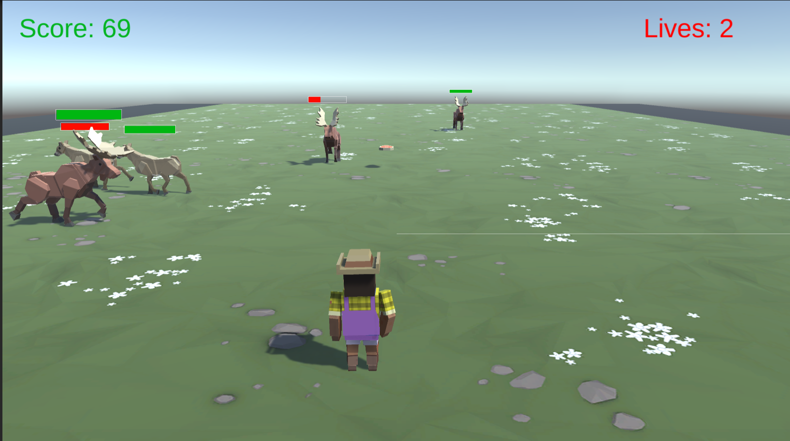

# Animal Feeder

Animal Feeder is a 3D game created in Unity where animals randomly come from the front and both sides of the screen, and the player's objective is to feed them by moving side-to-side and back-and-forth. The animals have different levels of hunger, and the player is rewarded different scores for feeding different animals. However, if an animal hits the player or walks past the camera unfed, the player loses a life. The game is over when the player loses all three lives. You can Play this game on [my itch.io page](https://aliqadir.itch.io/project-2) in the browser or download the executable file for Windows or MacOS.

## How to Play

-   Use the arrow keys or A/D keys to move left and right, W/S keys to move forwards and backwards.
-   As the animals approach, use the space bar to toss food in their direction.
-   Be sure to feed each animal before they walk past the camera or you will lose one life.
-   You have three lives in total, and the game ends when you lose them all.

Different animals have different levels of hunger, so feeding each animal will reward you with a different score. The game also features random spawning of animals from the front and both sides, so you'll need to be alert and quick on your feet.

## Installation

To play the game, you can either play it in the browser or download the pre-built executable for your operating system from my [itch.io page](https://aliqadir.itch.io/project-2), or you can clone the repository and open it in Unity to build and run the game from the source code.

## License

This project is licensed under the MIT License. Feel free to modify and use any of the code for your own purposes, but please credit the original author if you share or distribute any modified versions of this project. See the [LICENSE](./LICENSE.txt) file for details.

## Acknowledgements

The assets of the project were provided by Unity.

## Credits

This game was created by **ALI QADIR** using the Unity game engine. Some of the animal models and textures used in the game are not for redistribution and are credited to their original authors.

## Contact

If you have any questions or suggestions, feel free to contact me at [LinkedIn](https://www.linkedin.com/in/ali-qadir-1509b1226/) or [Instagram](https://www.instagram.com/oily.oli/). Alterenatively, you can also leave a comment on my [itch.io page](https://www,aliqadir.itch.io/project-2).
